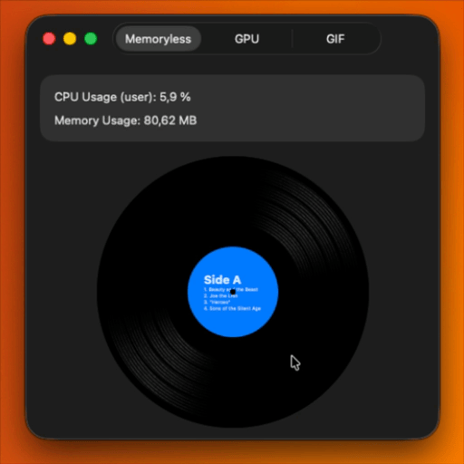

# VinylView

A SwiftUI package that renders an animated vinyl record with a customizable label. Supports macOS, iOS, and tvOS.



## Features

- Procedurally generated groove texture via Metal shaders
- Smooth spin-up and spin-down animation — always stops with the label facing forward
- Three rendering modes to suit different performance/quality trade-offs
- Customizable label image, label color, diameter, and groove track count
- Any SwiftUI view as label content

## Installation

Add the package via Swift Package Manager:

```
https://github.com/your-username/VinylView
```

## Usage

```swift
import VinylView

VinylView(
    label: NSImage(named: "album-art"),   // optional label image
    labelColor: .systemBlue,              // fallback color if no image
    diameter: 300,
    tracksCount: 5,                       // number of groove rings on the platter
    isPlaying: isPlaying,
    mode: .memoryless                     // see Rendering Modes below
) {
    // Any SwiftUI content shown on the label
    VStack {
        Text("Side A").bold()
        Text("1. Cat's Eye").font(.caption)
        Text("2. Windy Summer").font(.caption)
    }
}
```

Tapping the view toggles playback. You can also bind `isPlaying` externally.

## Rendering Modes

| Mode | Description |
|------|-------------|
| `.memoryless` | Generates the groove texture on the GPU every frame. Lowest memory, best for a single instance. |
| `.gpu` | Pre-renders frames into GPU textures at startup, then cycles through them. Smooth playback with a one-time setup cost. |
| `.gif` | Encodes frames as an animated GIF at startup and uses the system image view for playback. Highest compatibility, highest memory. |

## Parameters

| Parameter | Type | Description |
|-----------|------|-------------|
| `label` | `NSImage?` / `UIImage?` | Image displayed on the center label |
| `labelColor` | `NSColor?` / `UIColor?` | Background color of the label (used when no image is provided) |
| `diameter` | `CGFloat` | Diameter of the record in points |
| `tracksCount` | `Int` | Number of concentric groove rings drawn on the platter |
| `isPlaying` | `Bool` | Whether the record is spinning |
| `mode` | `VinylViewMode` | Rendering backend (`.memoryless`, `.gpu`, `.gif`) |
| `content` | `() -> Content` | SwiftUI view displayed on the center label |

## Requirements

- Swift 5.7+
- macOS 12+ / iOS 15+ / tvOS 15+
- Metal-capable device
